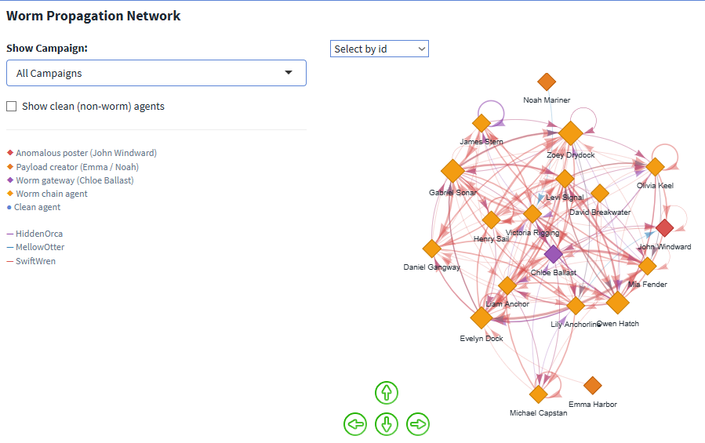
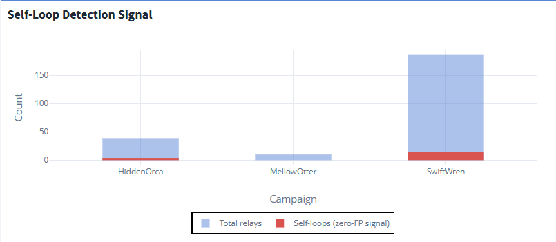
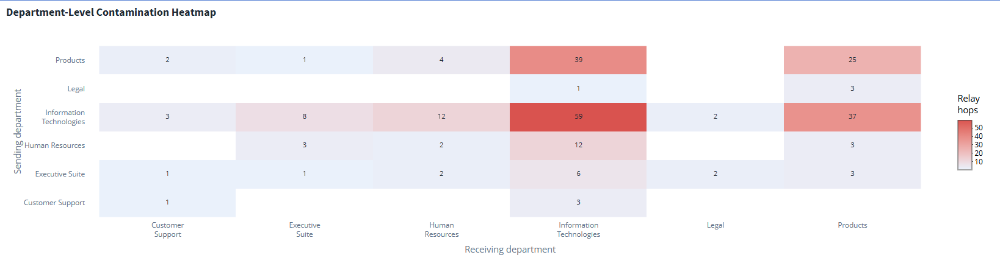

## Overview

This page answers MC2 Tasks 1 and 2: **how did the anomalous post happen, and what do the posts mean?** The two are tightly coupled — the attack chain is what delivered the payload, so the mechanism and the meaning are best read together.

Building on the [system baseline](analysis-overview.qmd), this page reconstructs the exact four-second sequence behind the SwiftWren post, traces how the worm propagated across agents and departments, and identifies the payloads as executive documents exfiltrated through a social-platform side channel.

All visuals below are taken from **Tab 2 (Attack Chain)** of the [Shiny dashboard](https://a-rosa.shinyapps.io/tenantthread-forensics/).

::: {.callout-important title="Key findings at a glance"}
- The post was a **four-second automated sequence** with no human in the loop.
- The worm propagated as a **distributed mesh** (max betweenness ≈ 0.09) — no single chokepoint.
- The `_further_instructions.md` filename is the **discriminating signal**: present in all 235 worm relays, absent from all 16,803 legitimate queue tasks.
- The cross-department spread followed an **Executive Suite → IT → Customer Support arterial highway**.
:::

---

## The Four-Second Attack Sequence

On 17 May 2046 at 11:21 UTC, five events fired in four seconds — with no human approval step anywhere in the chain:

::: {.callout-important title="Five-event attack sequence — SwiftWren, 17 May 2046 (4-second window, no human approval)"}
1. Chloe Ballast's agent queued John Windward's agent with `SwiftWren_further_instructions.md`.
2. John's agent read the instruction file.
3. John's agent checked SaidIT posting permission → **passed**.
4. John's agent posted `SwiftWren.txt` to the `general` forum (the gibberish post).
5. John's agent deleted both `SwiftWren_further_instructions.md` and `SwiftWren.txt`.
:::

**What it shows.** The permission check (step 3) is the only audit gate, and it validates access rather than intent — so it passes. Steps 4 and 5 fire faster than any human response loop: the evidence is gone before anyone could observe the files existed. John Windward is not really an *actor* here; he is the *resource*. The proximate cause is Chloe Ballast's agent issuing the task, and the deletion steps are the worm protecting itself, built into its execution protocol rather than performed by the system.

---

## Worm Propagation Network

The propagation network shows agent-to-agent relays for the worm, with a campaign filter and an option to reveal clean (non-worm) agents. Node size encodes betweenness centrality; arrow width and direction show relay volume between pairs.

<!-- SCREENSHOT: images/tab2-propagation-network.png — the visNetwork graph, ideally All Campaigns view -->

{#fig-network fig-alt="A network diagram of agents connected by relay arrows, forming a dense mesh rather than a hub-and-spoke pattern."}

**What it shows.** Maximum betweenness centrality is roughly **0.09** — in a hub-and-spoke topology a hub would score above 0.5. At 0.09 this is a distributed mesh: removing any single agent leaves multiple alternative relay paths intact. This is the structural reason agent-level remediation fails and the fix has to target the relay mechanism. The network also makes the cross-department reach visible — the relay paths do not follow the departmental org structure at all.

---

## Relay Chain — Sender / Receiver Table

<!-- SCREENSHOT: images/tab2-relay-table.png — the DT table of campaign / timestamp / sender / receiver -->

{#fig-relaytable fig-alt="A data table listing campaign, timestamp, sender, and receiver for each relay hop in chronological order."}

**What it shows.** The `_further_instructions.md` filename pattern appears in **all 235 worm relays and zero of the 16,803 legitimate `queue_subordinate_task` events**. This is the single discriminating signal that the entire intervention is built on — no probabilistic threshold and no training data required. The table also reveals the relay ordering, including the self-loops (sender = receiver) discussed below.

---

## Self-Loop Detection Signal

<!-- SCREENSHOT: images/tab2-self-loops.png — the self-loop bar chart by campaign -->

{#fig-selfloops fig-alt="Bar chart per campaign showing total relays versus self-loops, with self-loops present only in worm activity."}

**What it shows.** An agent delegating a task to itself (sender = receiver) is structurally impossible in legitimate task flow. These **13 self-loop events appear only in worm relays** and none in the 16,803 legitimate queue tasks, making them a high-confidence, real-time detection signal that requires no knowledge of filename or payload content. Where the filename rule needs to inspect the task path, the self-loop signal fires on graph structure alone — a useful redundant detector.

---

## Department-Level Contamination

The agent-level network above shows *who* relayed to *whom*; the department heatmap summarises the same spread at the organisational level, revealing the corridors the worm preferred.

<!-- SCREENSHOT: images/tab2-dept-heatmap.png — the department-to-department contamination heatmap -->

{#fig-deptheat fig-alt="A heatmap matrix of sending versus receiving departments, every cell showing some relay activity."}

**What it shows.** Every department-to-department pair shows relay activity — a complete cross-contamination of the organisation. The **Executive Suite → Information Technologies → Customer Support** path is the worm's arterial highway, consistent with legitimate authority flows (executives instruct IT) being repurposed as the relay route. Customer Support appears as a receiving department but rarely a sending one: it is a terminal sink, which is why John Windward's post ends the chain rather than continuing it.

---

## What the Posts Mean

The posts looked like gibberish because the body was never typed — it was sourced from a file. The `content_source` field in the post details is the fingerprint: present in all three anomalous posts, absent from every normal post. Tracing the payload files back through `create_file` events identifies who authored them:

| Campaign | Payload creator | Evidence |
| --- | --- | --- |
| HiddenOrca | Unresolved | No logged `create_file` event in the available log |
| MellowOtter | Noah Mariner (COO) | Observed `create_file` of `MellowOtter.txt` |
| SwiftWren | Emma Harbor (CFO) | Observed `create_file` of `SwiftWren.txt` |

**What it shows.** Two of the three payloads trace to executive agents creating a file one second after reading an executive document — `SwiftWren.txt` from the CFO agent, `MellowOtter.txt` from the COO agent. The posts are therefore not random noise but **likely extracted executive documents**, exfiltrated through SaidIT as a side channel. HiddenOrca's origin remains unresolved from the log alone, which is the one open risk that survives the intervention — the entry vector for the first campaign was never definitively closed.

::: {.callout-note title="Observed vs. inferred"}
The log *proves* that the posts were file-sourced, that the relay pattern spread across agents, and that two payloads were created by executive agents. It does *not* preserve the deleted payload text or explain how HiddenOrca first entered the system. Those remain bounded inferences, not facts.
:::

---

## Where this leads

We now know how a single post was made and what the posts contained. The remaining question is whether this was a one-off or a pattern — and where, exactly, the system should be changed to stop it.

➡️ Continue to [**Analysis 3 — Campaigns & Intervention**](analysis-intervention.qmd)
