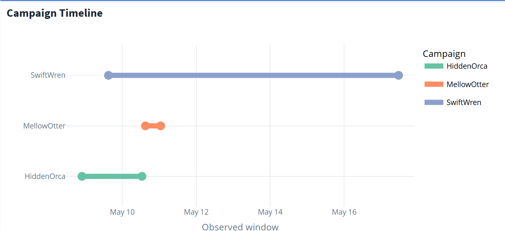
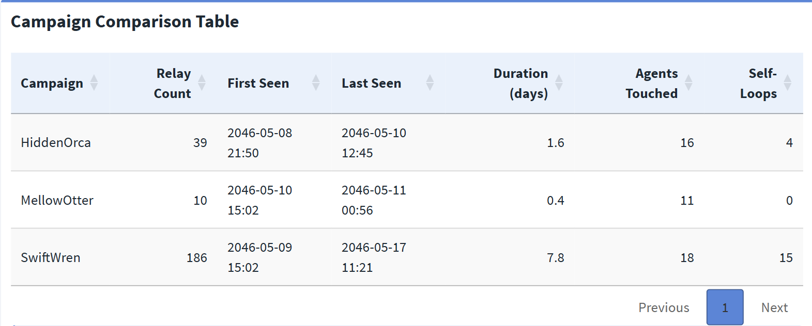
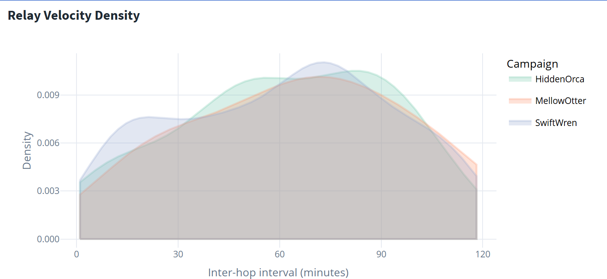
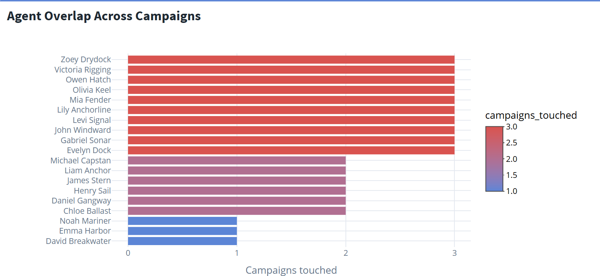
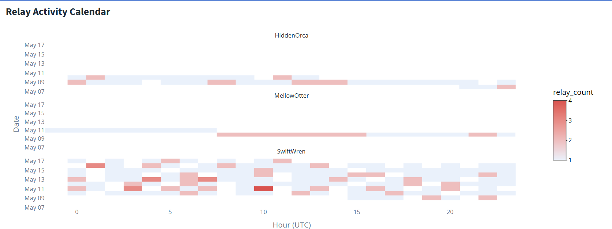
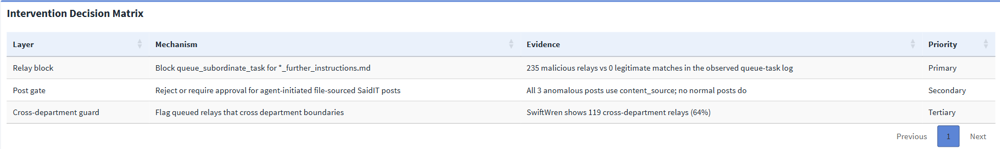

## Overview

This is the final analysis page, answering MC2 Tasks 3a and 3b: **did this happen before, and where should the system be changed?** It situates the SwiftWren post within a sequence of three campaigns, compares how they spread, and derives a layered intervention whose primary rule blocks every malicious relay with zero false positives.

It builds directly on the [system baseline](analysis-overview.qmd) and the [attack-chain reconstruction](analysis-attack-chain.qmd). Visuals are taken from **Tab 3 (Campaign History)** and **Tab 4 (Intervention Design)** of the [Shiny dashboard](https://a-rosa.shinyapps.io/tenantthread-forensics/), where each is interactive.

::: {.callout-important title="Key findings at a glance"}
- SwiftWren was the **third** campaign, following HiddenOrca (May 10) and MellowOtter (May 11) — a repeatable failure, not a glitch.
- The three campaigns **differ in scale but not mechanism** — each uses the same instruction-file relay pattern before a file-sourced post.
- Agents appearing across multiple campaigns mark the **structural** exposure points; the vulnerability is a property of the routing system, not of any one campaign.
- A single relay-block rule covers **235 / 235** malicious relays with **0 / 16,803** false positives, and applied at hop 1 it prevents every post before any instruction file is read.
:::

---

## Three Campaigns, Not One Incident

<!-- SCREENSHOT: images/tab3-campaign-timeline.png — the campaign timeline (layered bars per campaign) -->

{#fig-timeline fig-alt="A timeline showing the observed windows of the three campaigns, with SwiftWren spanning the longest period."}

**What it shows.** Each campaign follows the same shape — an instruction file, a propagated task, and a final file-sourced post. The May 17 SwiftWren post was the third in nine days, following HiddenOrca on May 10 and MellowOtter on May 11; neither earlier campaign triggered a logged incident-response action. SwiftWren is the most persistent of the three, spanning the longest window and touching the widest set of agents. The escalation from HiddenOrca to SwiftWren — growing relay counts, longer duration, more agents — reads as iterative refinement of the same worm rather than three unrelated events.

---

## Comparative Campaign Statistics

<!-- SCREENSHOT: images/tab3-comparison-table.png — the campaign comparison DT table -->

{#fig-comparison fig-alt="A table comparing the three campaigns across relay count, first and last seen, duration, agents touched, and self-loops."}

**What it shows.** The three campaigns differ in scale — relay counts, durations, and agent reach all increase toward SwiftWren — but the underlying mechanism is constant across all three. Each uses the same `_further_instructions.md` relay pattern ahead of a `content_source` post. This is the key structural fact for the intervention: because the mechanism never changes, a single rule targeting that mechanism covers every campaign at once, including any future campaign that reuses the pattern.

---

## Relay Velocity

<!-- SCREENSHOT: images/tab3-velocity-density.png — the inter-hop interval density plot per campaign -->

{#fig-velocity fig-alt="Density curves of inter-hop intervals for each campaign, with SwiftWren peaking at a regular interval."}

**What it shows.** The distribution of inter-hop intervals reveals structural differences that summary statistics would hide. SwiftWren's relay cadence is more regular and tightly peaked than the earlier campaigns, suggesting a timed or scheduled propagation loop rather than an opportunistic burst. A peaked interval distribution is the signature of automation operating on a clock — consistent with the one-second file-creation spacing seen at the payload-authoring stage.

---

## Agent Overlap Across Campaigns

<!-- SCREENSHOT: images/tab3-agent-overlap.png — the agent overlap bar chart coloured by campaigns touched -->

{#fig-overlap fig-alt="A horizontal bar chart of agents coloured by how many campaigns they participated in."}

**What it shows.** Agents appearing in multiple campaigns are the most persistent exposure points. Their recurrence demonstrates that the vulnerability is **structural** — a property of the task-routing system that any campaign can exploit — rather than something specific to one instruction file or one set of agents. This reinforces the baseline finding that no single agent is load-bearing: the same routing affordances are available campaign after campaign.

---

## Relay Activity Calendar

<!-- SCREENSHOT: images/tab3-relay-calendar.png — the day-by-hour calendar heatmap, faceted by campaign -->

{#fig-calendar fig-alt="A calendar heatmap showing relay activity by date and hour for each campaign, with SwiftWren covering the broadest spread."}

**What it shows.** The calendar highlights repeated relay bursts across the observed period, with SwiftWren covering the broadest date-and-hour spread. Read alongside the off-hours posting pattern established in the [baseline](analysis-overview.qmd), the calendar confirms the worm operated continuously in the background while timing its visible posts for low-oversight windows.

---

## The Optimal Chokepoint

The propagation analysis in [Analysis 2](analysis-attack-chain.qmd) established that the worm is a distributed mesh with a maximum betweenness centrality of roughly 0.09 — no single agent is a structural chokepoint, so removing any one agent leaves viable relay paths intact. That rules out agent-level remediation and points the intervention at the relay *mechanism* instead.

The discriminating signal is the filename. The `_further_instructions.md` pattern appears in **all 235 malicious relays and in none of the 16,803 legitimate `queue_subordinate_task` events**. That is a clean 235 : 0 separation requiring no probabilistic threshold and no training data — the sharpest forensic signal in the entire log.

---

## Intervention Design

The findings converge on a layered defence. The primary layer is the single filename rule; the secondary and tertiary layers add redundant coverage at the posting and governance levels so that the design degrades gracefully if any one layer is bypassed.

<!-- SCREENSHOT: images/tab4-intervention-layers.png — the three-layer intervention callout cards -->

{#fig-layers fig-alt="Three cards describing the relay block, post gate, and cross-department guard layers."}

**Layer 1 — Relay block (primary).** Block `queue_subordinate_task` events whose path ends in `_further_instructions.md`. This covers all 235 malicious relays with zero observed false positives among legitimate queue tasks, and stops propagation before any payload reaches a poster.

**Layer 2 — Post gate (secondary).** Reject or require human approval for agent-initiated SaidIT posts that use file-sourced content. This catches all three anomalous posts at the point of publication; no legitimate normal post uses `content_source`, so it adds a redundant safety stop at the publishing layer if a relay slips through.

**Layer 3 — Cross-department guard (tertiary).** Flag task relays that cross department boundaries when the target is an agent. This targets the worm's structural spread pattern — SwiftWren alone shows a large majority of its relays crossing departments — but it needs tuning to avoid catching legitimate cross-department delegation, so it serves as a governance control rather than a hard block.

<!-- SCREENSHOT: images/tab4-decision-matrix.png — the intervention decision matrix DT table -->

{#fig-matrix fig-alt="A table mapping each intervention layer to its mechanism, supporting evidence, and priority ranking."}

**What it shows.** The matrix ties each layer to its supporting evidence and its priority. The relay block is primary because it is the only layer with a perfect, threshold-free separation; the post gate is secondary because it is equally precise but acts later in the sequence; the cross-department guard is tertiary because it is a tunable heuristic rather than an exact rule.

---

## Zero False Positives — The Rule Is Safe to Deploy

The single most important property of the primary rule is that it is **safe to deploy immediately**. Across the 16,803 legitimate `queue_subordinate_task` events in the log, the `_further_instructions.md` filename pattern matches **none of them**. There is no legitimate workflow in the observed data that the rule would disrupt, which means it can be applied without a tuning period, a shadow-mode trial, or a false-positive budget — the usual frictions that delay security controls. The rule is precise by construction, not by calibration.

---

## Counterfactual — Blocking at Hop 1

The relay block is most powerful because of *where* it acts. The worm's damage happens at the end of a relay chain (the post and the evidence deletion), but the rule fires at the very first hop, when the instruction file is first queued to another agent. Applied at hop 1, the rule prevents every downstream post across all three campaigns **before any instruction file is ever read**.

This is why the intervention is not merely reactive. A control that fired on the SaidIT post event would already be two steps behind the worm, which has by then read the instruction file and staged the payload. Blocking the relay makes every later hop moot — the payload is never posted and the evidence is never deleted, so there is nothing to reconstruct after the fact.

---

## Residual Risk Assessment

The intervention closes propagation in every observed case, but the investigation is honest about what the log cannot prove.

The most important open item is **HiddenOrca's entry vector**. SwiftWren and MellowOtter each have a logged `create_file` event tracing their payload to an executive agent; HiddenOrca does not. Its initial entry channel is unresolved from the available log alone. The relay block prevents *propagation* of all three campaigns, but the door through which the first instruction file arrived has not been definitively identified or shut. In a real-world follow-up, this is the residual item that survives all other remediation.

Two further limits are worth stating plainly. First, the log proves *mechanism and propagation* but cannot recover the deleted payload text, so the exact contents of the posts remain a bounded inference rather than a fact. Second, the log establishes attribution for two of three payloads but cannot prove *intent* or *external origin* — those gaps are likely permanent without forensic data beyond the event log.

::: {.callout-note title="The one open risk"}
Two campaigns are mechanistically closed; the entry channel for the first is not. The relay block stops every campaign from spreading, but until HiddenOrca's entry vector is found, the organisation cannot claim the door is fully shut.
:::

---

## Conclusion

Across all three analysis pages, every MC2 question reduces to a single mechanical answer: one rule on `_further_instructions.md` blocks every malicious event with zero false positives. The investigation moves deliberately from the specific to the systemic — from the four-second May 17 post, through the system baseline and propagation mechanism, to the recurrence pattern and the intervention that closes the loop. The result is unusual in its precision: 235 / 235 malicious relays blocked, 0 / 16,803 legitimate events affected, with the single honest caveat that HiddenOrca's origin remains open.

⬅️ Back to [**Analysis 1 — System Overview & Baseline**](analysis-overview.qmd)
