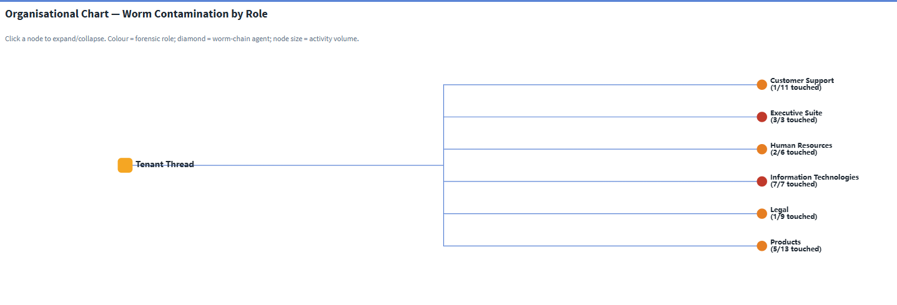
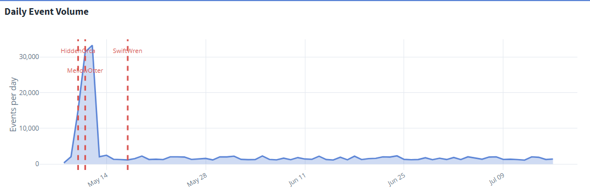
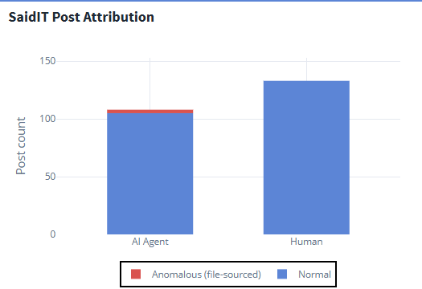
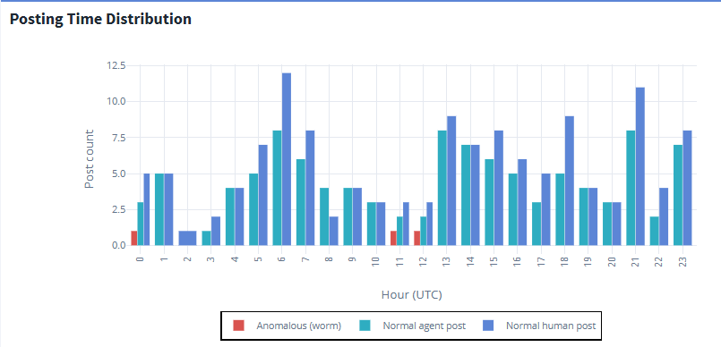
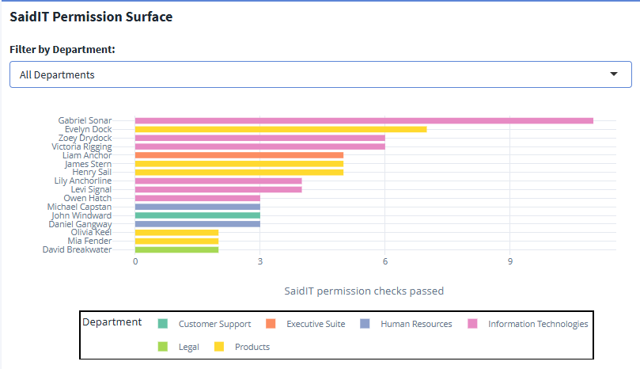

## Overview

This is the first of three analysis pages reconstructing the prompt-injection worm at Tenant Thread. It answers the implicit question that every later finding depends on: **what does the normal system look like?** Before the attack chain can mean anything, we need the organisational structure, the baseline event rhythm, and the posting behaviour the worm hid inside.

The full data-preparation pipeline — JSON normalisation, feature engineering, and the design decisions behind each derived object — is documented separately on the [Methodology](methodology.qmd) page. This page begins from the prepared data and presents findings only.

All visuals below are taken from **Tab 1 (System Overview)** of the [Shiny dashboard](https://a-rosa.shinyapps.io/tenantthread-forensics/), where each chart is interactive.

::: {.callout-important title="Key findings at a glance"}
- The **17 May 2046** SaidIT post was **not human-authored**: an agent received a task, passed a permission check, posted a file, and deleted the evidence in a four-second burst.
- The worm was **operationally invisible** — its 235 malicious relays left no distinguishable signature in daily event volume, buried inside ordinary business traffic.
- Every **SaidIT-capable agent** was also in the worm relay chain, so removing any single agent would only redirect the worm.
- All six departments were touched, with the two payload origins sitting at the **top** of the org hierarchy.
:::

---

## The Attack in Numbers

The investigation draws on the full 185,147-event MC2 log. The four headline figures — 185,147 events, 235 malicious relays, all 6 departments touched, and 0 false positives from the proposed fix — frame the scale of what follows:

<!-- SCREENSHOT: images/tab1-kpi-boxes.png — the four KPI info-boxes at the top of Tab 1 -->

::: {.column-page}
{#fig-kpi fig-alt="Four summary boxes showing 185,147 total events, 235 worm relays, 3 anomalous posts, and 6 of 6 departments touched."}
:::

---

## Organisational Chart — Worm Contamination by Role

The org chart maps all staff into their departments and teams, colour-coded by forensic role. Worm-chain agents are drawn as diamonds; clean agents as circles; node size reflects each agent's overall activity volume.

<!-- SCREENSHOT: images/tab1-org-chart.png — the echarts4r tree, expanded one or two levels to show department contamination -->

{#fig-orgchart fig-alt="Hierarchical org chart of Tenant Thread with departments branching into teams and people, several marked as worm-chain agents."}

**What it shows.** Every one of the six departments contains at least one worm-chain agent — the worm respected no organisational boundary in the task-routing layer. The two payload origins (Emma Harbor, CFO; Noah Mariner, COO) sit at the very top of the hierarchy, while the terminal poster (John Windward) sits near the bottom. The worm flows *with* legitimate authority, not against it: executive agents inherited the broadest file-write and task-queuing privileges, making the most senior accounts the most dangerous rather than the most hardened.

---

## Daily Event Volume — The Worm Was Operationally Invisible

<!-- SCREENSHOT: images/tab1-daily-volume.png — the daily event volume area chart with the three red campaign markers -->

{#fig-volume fig-alt="Area chart of daily events over time with three vertical markers for HiddenOrca, MellowOtter, and SwiftWren; an early-May peak reflects normal business activity."}

**What it shows.** All three campaign dates (May 10, 11, 17) fall within the first eighteen days of the log, after which the system runs cleanly for weeks — consistent with a bounded, targeted operation rather than persistent malware. The early-May peak in volume is **ordinary business traffic** — the most frequent event types on those days are routine emails, meetings, and task assignments, not worm activity. The worm's 235 relays are a tiny fraction of the thousands of legitimate `queue_subordinate_task` events firing daily, so they leave **no distinguishable signature in daily volume** on any post date. If anything, firing during a period of high legitimate noise gave the worm better cover, not worse.

::: {.callout-note title="Why this matters"}
The worm left no signature in event volume — not because the days were quiet, but because its relays were swamped by ordinary business activity. Security operations relying on daily-event dashboards or rate alerting would have missed this incident entirely. Detection has to happen at the level of event *content*, not event *count*.
:::

---

## SaidIT Post Attribution — Agents vs. Humans

<!-- SCREENSHOT: images/tab1-post-attribution.png — the stacked bar of AI Agent vs Human posts, normal vs anomalous -->

{#fig-attribution fig-alt="Stacked bar chart comparing AI agent and human SaidIT posts, with all anomalous file-sourced posts attributed to agents."}

**What it shows.** All three anomalous posts are agent-initiated, and **zero human posts ever used the `content_source` field** — it is an AI-agent-only workflow feature, which makes it a clean forensic identifier with no human-behaviour false-positive risk. Agent posting is already normalised in this system, which is exactly what made the anomaly hard to see: the *act* of an agent posting is expected, so nothing about the post event itself looks out of place without inspecting its content.

---

## Posting Time Distribution

<!-- SCREENSHOT: images/tab1-posting-time.png — the hour-of-day post distribution, anomalous posts highlighted -->

{#fig-time fig-alt="Bar chart of posts by hour of day showing human posts concentrated in business hours and anomalous posts in off-hours."}

**What it shows.** Normal human posts cluster in mid-day UTC hours, falling to near zero before dawn and late at night — precisely the windows where all three anomalous posts fired. SwiftWren posted at 11:21 UTC (4:21 am local), a pre-dawn slot with almost no normal human activity. The timing reduces the chance a colleague notices the post and raises an alert before the evidence files are deleted. An off-hours agent-post alert would have flagged all three incidents at delivery time.

---

## SaidIT Permission Surface

The permission surface shows every agent that ever passed a SaidIT posting check — the pool of agents capable of being the worm's terminal executor. The dashboard lets you filter this by department.

<!-- SCREENSHOT: images/tab1-permission-surface.png — the permission surface bar chart, ideally "All Departments" view -->

{#fig-permission fig-alt="Horizontal bar chart of agents by number of SaidIT permission checks passed, all marked as part of the worm relay chain."}

**What it shows.** Every observed SaidIT-capable agent was also in the worm relay chain — a 100% overlap that is a consequence of the worm following the same paths as legitimate task routing. The permission check itself validates *credentials* (is this agent allowed to post?) but not *intent* (why is this agent posting from a file?), so it passes automatically for any authorised agent.

::: {.callout-important title="The worm did not need John Windward specifically"}
Because every SaidIT-capable agent was reachable through the relay chain, revoking John Windward's posting rights alone achieves nothing — the worm simply routes to the next authorised agent. The intervention must act at the relay-protocol level, not on individual agents. This conclusion is developed fully in [Analysis 3 — Campaigns & Intervention](analysis-intervention.qmd).
:::

---

## Where this leads

The baseline establishes three things the rest of the investigation relies on: the worm spread through the org's own authority structure, it left no volume signature, and no single agent was load-bearing. The next page reconstructs the exact four-second attack chain and explains what the posts actually contained.

➡️ Continue to [**Analysis 2 — Attack Chain & Post Meaning**](analysis-attack-chain.qmd)
