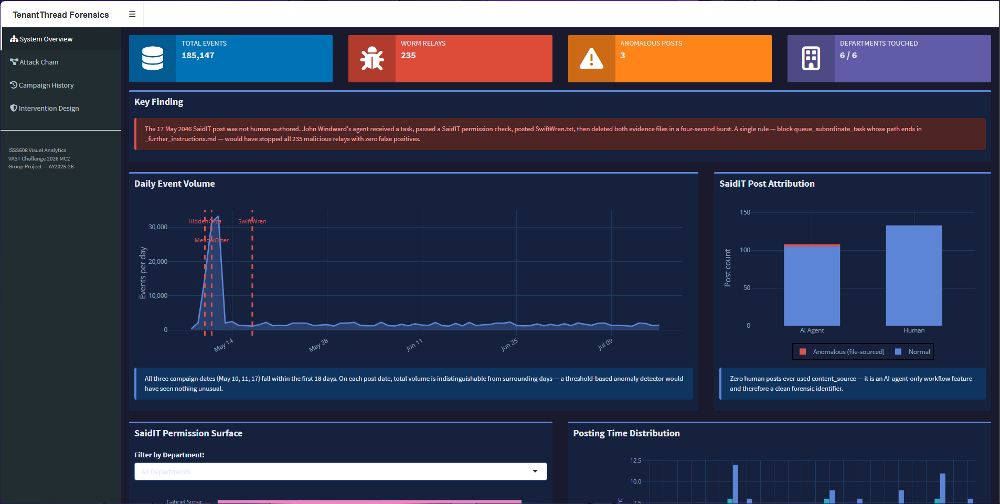

# Introduction

The TenantThread Forensics Dashboard is an interactive visual analytics application built to support forensic investigation of the TenantThread AI worm propagation incident. Using data spanning three attack campaigns — HiddenOrca, MellowOtter, and SwiftWren — the dashboard allows analysts to trace how the worm spread between AI agents, reconstruct attack chains, and evaluate potential interventions.

This user guide covers the Introduction page and the two tabs developed by Amelia: Tab 1 (System Overview) and Tab 2 (Attack Chain Reconstruction). Tabs 3 and 4 are covered separately by Tam.

## How to Access

Open any modern web browser and navigate to:

https://a-rosa.shinyapps.io/tenantthread-forensics/

No login or installation is required. The application loads directly in-browser. Allow a few seconds on first load as the data initialises in the background.

## Application Layout

The dashboard uses a dark navy sidebar layout. The left sidebar contains the application title and the main navigation menu. Clicking a menu item switches the main content panel on the right. The four tabs are:

| Tab | Owner | Purpose |
|-----------------|----------------|---------------------------------------|
| Tab 1 – System Overview | Amelia | High-level summary of all events, actors, and timeline across the three campaigns |
| Tab 2 – Attack Chain Reconstruction | Amelia | Step-by-step backward chain reconstruction tracing how the worm reached each terminal actor |
| Tab 3 – Campaign History | Tam | Temporal patterns and recurrence analysis across the three campaigns |
| Tab 4 – Intervention Design | Tam | Counterfactual simulation and proposed fix for disrupting worm propagation |

# Tab 1: Sytem Overview

The System Overview tab gives analysts a bird's-eye view of the TenantThread incident. It presents the full event timeline, a breakdown of events by campaign and actor type, and a summary statistics table — all filterable by campaign. This tab is intended as the starting point for any investigation, helping the analyst orient themselves before drilling into a specific chain in Tab 2.

## Event Timeline Plot

Each point represents a single logged event in the dataset. Events are plotted on the x-axis (timestamp) and coloured by campaign. Vertical dashed lines mark key anomaly dates identified during analysis.

[1]  Hover Tooltip — Hover over any point to see a pop-up showing the event's timestamp, actor name, action type, and campaign. This tooltip is interactive and powered by Plotly.

[2]  Zoom & Pan — Use the Plotly toolbar that appears in the top-right corner of the chart to zoom into a specific time window, pan across the timeline, or reset the view to default.

## Event Count Bar Chart

Displays the number of events per campaign (or per actor, depending on the current filter selection). Bars are colour-coded to match the timeline above for easy cross-reference.

Hover for Count — Hovering over a bar shows the exact event count for that category.

# Tab 2: Attack Chain Reconstruction

The Attack Chain Reconstruction tab is the analytical centrepiece of the dashboard. It allows the analyst to select any terminal actor — an AI agent that was ultimately compromised by the TenantThread worm — and reconstruct the full backward propagation chain showing exactly which agents passed the worm, and in what sequence, before it reached that target. Both an interactive network graph and a step-by-step event table are provided.

